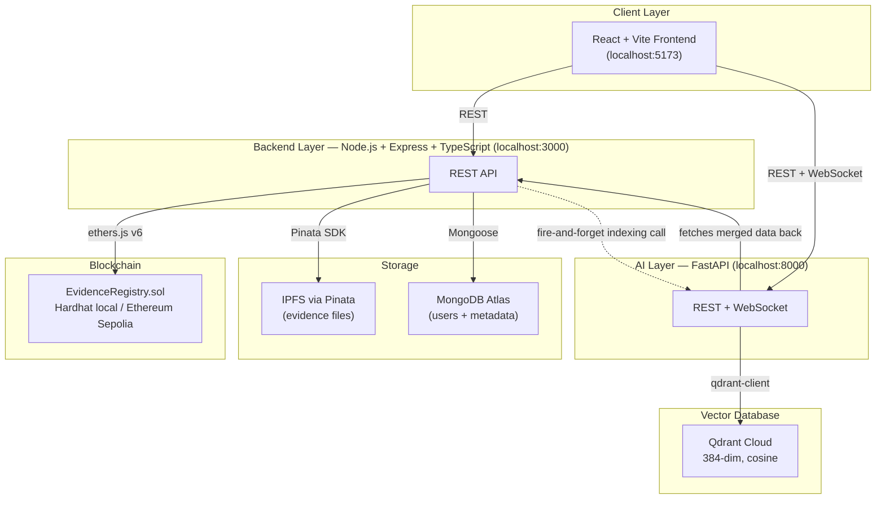

# Honora — Architecture Document

| | |
|---|---|
| **Document type** | System Architecture |
| **Companion docs** | `PRD.md` (requirements this architecture satisfies), `HLD.md` (module-level design), `LLD.md` (implementation detail) |

---

## 1. Architectural Style

Honora is a **layered, service-oriented system** with four independently-runnable layers, each
with a single clear responsibility. No layer directly reaches into another layer's storage — all
cross-layer communication happens over well-defined interfaces (REST, WebSocket, JSON-RPC via
ethers.js).



---

## 2. System Context

**Actors**: Police, Forensic, Lawyer, Judge (all authenticated via JWT; roles enforced twice — see
§7).

**External systems Honora depends on**:
| System | Role | Why external |
|---|---|---|
| Ethereum (Hardhat local / Sepolia testnet) | Immutable ledger of evidence existence, custody, roles | Public verifiability and tamper-proofing require a chain Honora doesn't control |
| IPFS (via Pinata) | Content-addressed file storage | Storing raw file bytes on-chain would be prohibitively expensive in gas |
| MongoDB Atlas | Off-chain metadata (case names, departments, filenames, user accounts) | Chain storage is optimized for small, fixed fields — rich strings belong off-chain |
| Qdrant Cloud | Vector similarity search | Purpose-built for the nearest-neighbor search semantic search and cross-case linkage require |

---

## 3. Technology Stack and Rationale

| Layer | Technology | Why this choice |
|---|---|---|
| Smart contract | Solidity 0.8.24 | Built-in overflow checks (0.8+), custom errors (gas-efficient reverts) |
| Contract framework | Hardhat v3 | Local chain simulation, scripting, ethers integration |
| Contract interaction | ethers.js v6 | Mature, typed, well-documented Ethereum client library for Node |
| Backend runtime | Node.js v22 + Express | Team familiarity; Express is minimal and unopinionated, fits a thin orchestration layer |
| Backend language | TypeScript (ESM) | Type safety across contract ABI types, Mongoose schemas, and request/response shapes |
| Auth | JWT (HS256) + bcrypt (12 rounds) | Stateless auth (no session store needed); bcrypt is the standard for password hashing |
| Off-chain DB | MongoDB Atlas (Mongoose) | Schema-flexible enough for evolving metadata; managed/cloud so it survives local dev resets |
| File storage | IPFS via Pinata | Decentralized, content-addressed; Pinata removes the need to run/pin your own IPFS node |
| File hashing | SHA-256 | Industry-standard collision resistance for integrity verification |
| AI/NLP | FastAPI + sentence-transformers (`all-MiniLM-L6-v2`) | FastAPI's async support suits I/O-bound embedding/IPFS-fetch workloads; MiniLM is small (384-dim), fast enough for CPU inference, good semantic quality for its size |
| Vector DB | Qdrant Cloud | Purpose-built ANN search with metadata filtering, managed hosting, generous free tier |
| Document parsing | PyMuPDF (PDF) + python-docx (DOCX) | Both support structured table extraction, not just raw text dumps |
| Frontend | React 18 + Vite + React Router 6 | Fast dev server, component-based UI suits four distinct role dashboards sharing common pieces |
| Real-time | WebSocket (FastAPI native) | Needed for push-style cross-case alerts; polling would add latency and load |

---

## 4. Data Storage Strategy — What Lives Where, and Why

| Data | Location | Reason |
|---|---|---|
| Evidence file bytes | IPFS (via Pinata) | Expensive to store on-chain; content-addressing means the CID itself is a verifiable pointer |
| File SHA-256 hash | On-chain | Cheap (fixed-size string), and is the actual tamper-evidence mechanism |
| Evidence existence, custody chain, roles | On-chain | This is the data that must be immutable and independently auditable — the entire point of using a blockchain |
| Case name, department, filename, status | MongoDB | Rich/variable-length strings; expensive and unnecessary to store on-chain; not safety-critical to immutability |
| User accounts, password hashes | MongoDB | Off-chain by necessity — a wallet address's on-chain role doesn't carry email/password |
| Semantic embeddings | Qdrant | Vector search needs a purpose-built index; irrelevant to keep on-chain or in MongoDB |

This split means **two independent data stores must stay logically consistent** (MongoDB/Qdrant
persist across restarts; a local Hardhat chain does not) — see `LLD.md` §7 for the operational
implications of this and how reseeding/reindexing addresses it.

---

## 5. Deployment Topology

### Local development (5 independently-run processes)
```
Terminal 1: Hardhat node          (localhost:8545)  — in-memory chain, resets on restart
Terminal 2: deploy/seed scripts   (one-shot, via Hardhat)
Terminal 3: Backend               (localhost:3000)
Terminal 4: AI service            (localhost:8000, Python venv)
Terminal 5: Frontend              (localhost:5173, Vite dev server)
```

### Public testnet
The same `EvidenceRegistry` contract is deployed to **Ethereum Sepolia**
(`0xf4e1c0179acC2A54C195e8687621ee070be06B3C`), independently auditable via Etherscan, serving as
proof that the contract compiles and deploys correctly on a real public network. It is not
currently the backing chain for the live demo environment (local Hardhat is, for speed and
zero-cost iteration).

### Cloud dependencies (shared across environments)
MongoDB Atlas and Qdrant Cloud are used identically whether the backend points at local Hardhat or
Sepolia — only `RPC_URL` and `CONTRACT_ADDRESS` change.

---

## 6. Key Cross-Cutting Design Decisions

1. **Fire-and-forget AI indexing.** Evidence/document upload never blocks on, or fails because of,
   AI service availability. The indexing HTTP call from the backend is wrapped in try/catch and
   only logged on failure. This directly serves the requirement that core evidentiary operations
   must never depend on a convenience layer.
2. **Two-layer RBAC.** Role is checked once in Express middleware (fast, friendly 403, no gas
   spent) and again, authoritatively, by Solidity modifiers reading the `userRoles` on-chain
   mapping. The API layer can never be the sole point of enforcement — a bug or bypass there
   still cannot let an unauthorized wallet register evidence or transfer custody.
3. **Role-specific signer wallets.** Because the contract enforces `msg.sender`-based access
   control, the backend must sign supporting-doc uploads, custody transfers, and integrity checks
   using a private key matching the *caller's actual on-chain role*, not a single admin key. See
   `LLD.md` §2 for the exact selection logic.
4. **Off-chain metadata merge, not duplication of trust.** MongoDB metadata is convenience data
   only — no field stored there is treated as authoritative for anything security- or
   integrity-related. Every read endpoint that returns evidence data fetches the on-chain record
   as the source of truth and merges MongoDB fields on top.
5. **Chunked embeddings, not whole-document.** Long documents are split into overlapping 200-word
   windows before embedding (see `LLD.md` §6.2) so a single embedding doesn't have to represent an
   entire multi-page forensic report — improving both search precision and cross-case recall.

---

## 7. Security Architecture — Current State

| Control | Mechanism | Status |
|---|---|---|
| Authentication | JWT (HS256), bcrypt password hashing (12 rounds) | Implemented |
| Authorization | Dual-layer RBAC (API middleware + Solidity modifiers) | Implemented |
| Data integrity | On-chain SHA-256 hash, independently recomputable | Implemented |
| Audit trail | On-chain events for every state change | Implemented |
| Secrets management | `.env` files, gitignored | Implemented, but **not yet using a secrets manager** |
| Owner/role-assignment governance | Single EOA (deployer) has unilateral `assignRole`/`revokeRole` power | **Known centralization risk** — no multi-sig or timelock yet |
| Sepolia deployment credentials | Root `.env` pattern documented for `SEPOLIA_PRIVATE_KEY`/`SEPOLIA_RPC_URL` | **A historical commit hardcoded a real key + API key directly in `hardhat.config.ts`** — flagged for rotation; not yet remediated in this document's writing |

This section intentionally documents known gaps, not just what's implemented — a future security
hardening phase should treat this table as its starting checklist.

---

*Next: `HLD.md` for module-by-module responsibility breakdown and workflow sequence diagrams.*
