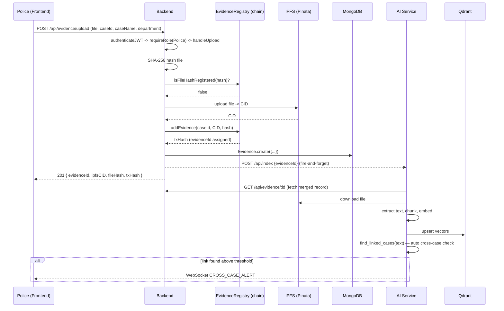
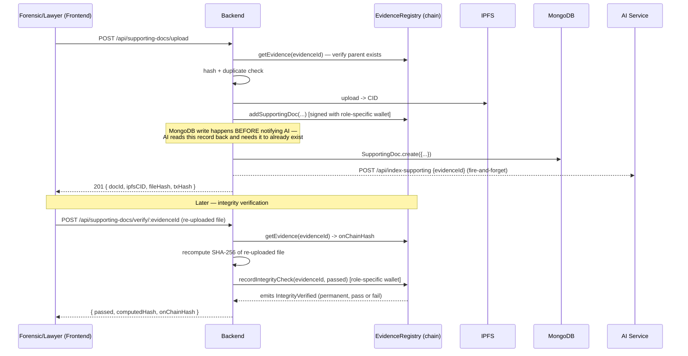
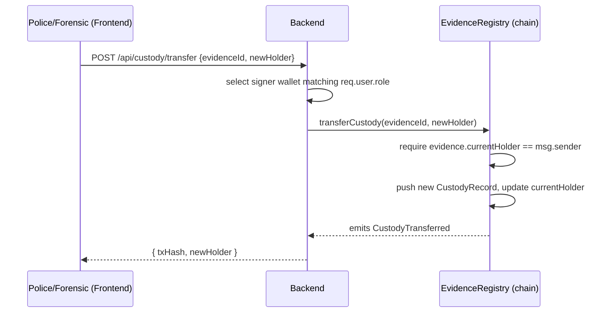
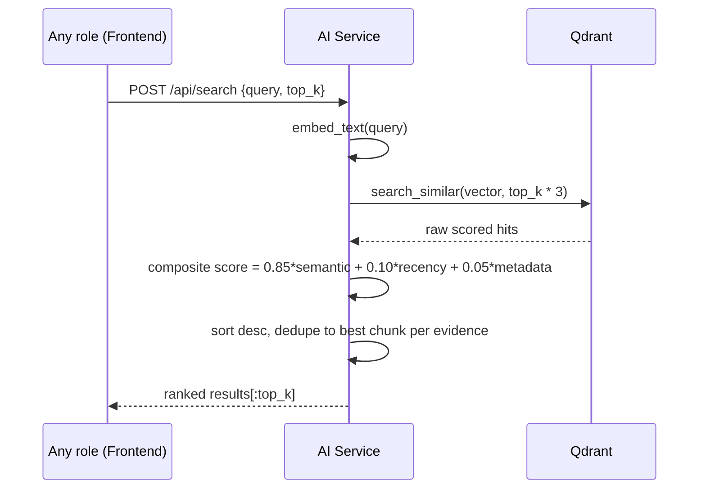
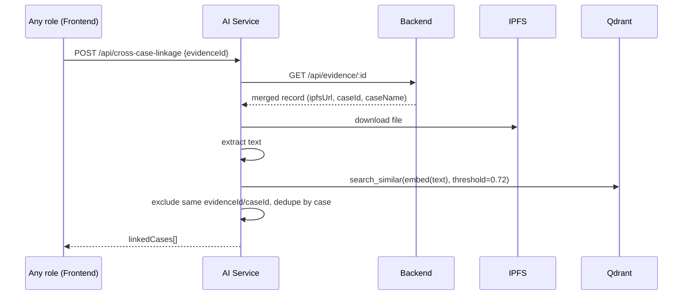

# Honora — High-Level Design (HLD)

| | |
|---|---|
| **Document type** | High-Level (module & workflow) Design |
| **Companion docs** | `ARCHITECTURE.md` (system-level design this refines), `LLD.md` (implementation-level detail this is refined by) |

---

## 1. Purpose

Where `ARCHITECTURE.md` describes the system as four layers and their technology choices, this
document breaks each layer into its constituent modules and describes how data actually flows
through them for each core workflow.

---

## 2. Module Breakdown

### 2.1 Smart Contract — `contracts/EvidenceRegistry.sol`

One contract, four responsibility groups:

| Group | Responsibility |
|---|---|
| Role management | `assignRole`, `revokeRole`, `getRole` — owner-only |
| Evidence lifecycle | `addEvidence`, `getEvidence`, `isFileHashRegistered` |
| Custody | `transferCustody`, `getCustodyHistory` |
| Supporting documents & integrity | `addSupportingDoc`, `getSupportingDocs`, `recordIntegrityCheck` |

Full function-by-function specification is in `LLD.md` §1.

### 2.2 Backend — `backend/src/`

| Module | Responsibility |
|---|---|
| `config/env.ts` | Load and fail-fast-validate every required environment variable at boot |
| `config/db.ts` | MongoDB connection lifecycle |
| `models/` | Mongoose schemas: `User`, `Evidence`, `SupportingDoc` |
| `middleware/auth.middleware.ts` | JWT verification, attaches `req.user` |
| `middleware/role.middleware.ts` | `requireRole(...)` — role gate, returns 403 if unauthorized |
| `middleware/upload.middleware.ts` | In-memory file upload (Multer), never touches disk |
| `services/contract.service.ts` | All ethers.js contract calls; owns ABI loading and role-signer selection |
| `services/hash.service.ts` | SHA-256 hashing |
| `services/pinata.service.ts` | IPFS upload via Pinata SDK |
| `services/auth.service.ts` | Register/login business logic, JWT signing |
| `controllers/` | Request orchestration — validation, calling services in the right order, response shaping |
| `routes/` | URL + HTTP method + middleware chain + controller wiring |

### 2.3 AI Service — `ailayer-querying/`

| Module | Responsibility |
|---|---|
| `main.py` | FastAPI app: all HTTP routes, WebSocket endpoint, JWT decoding for RBAC context |
| `embeddings.py` | Loads `all-MiniLM-L6-v2` once (singleton), exposes `embed_text`/`embed_batch` |
| `vector_store.py` | Qdrant client singleton, collection lifecycle, upsert, similarity search |
| `search.py` | Multi-factor re-ranking for user-facing semantic search |
| `cross_case.py` | Cross-case similarity search with a stricter, fixed threshold |
| `preprocessing.py` | PDF/DOCX text + table extraction, cleaning, chunking |
| `reindex.py` | Standalone operational script: rebuilds the entire Qdrant collection from current backend/Mongo state |

### 2.4 Frontend — `Honora--Frontend/`

| Module | Responsibility |
|---|---|
| `App.jsx` | Routing table, global providers, redirect logic for authenticated/unauthenticated states |
| `src/components/common/useAuth.jsx` | Auth context: login/signup/logout, localStorage persistence |
| `src/components/common/ProtectedRoute.jsx` | Route guard: auth + role check with role-aware redirects |
| `src/components/common/CrossCasePopup.jsx` | Persistent WebSocket listener + alert rendering |
| `src/components/common/SearchBar.jsx` | Semantic search UI |
| `src/components/{police,forensic,lawyer,judge}/` | One dashboard + case-detail + upload-modal set per role |
| `src/services/api.js` | Single fetch wrapper for both backend (3000) and AI service (8000); auto-attaches JWT |

---

## 3. Core Workflows

### 3.1 Evidence Upload

### 3.2 Supporting Document Upload + Integrity Verification

### 3.3 Custody Transfer

### 3.4 Semantic Search

### 3.5 Cross-Case Linkage (on-demand)

---

## 4. RBAC Design

| Action | Police | Forensic | Lawyer | Judge |
|---|:---:|:---:|:---:|:---:|
| Upload evidence | ✅ | – | – | – |
| Upload supporting docs | – | ✅ | ✅ | – |
| View evidence | ✅ | ✅ | ✅ | ✅ |
| Verify integrity | – | ✅ | – | ✅ |
| Transfer custody | ✅ | ✅ | – | – |
| Update case status | ✅ | – | – | – |
| AI semantic search | ✅ | ✅ | ✅ | ✅ |
| Cross-case linkage | ✅ | ✅ | ✅ | ✅ |
| Assign/revoke roles | Owner only | – | – | – |

Enforced twice, deliberately:
1. **Express middleware** (`requireRole`) — checks the role claim inside the JWT. Fast, no gas
   cost, returns a clear 403 with the required vs. actual role.
2. **Solidity modifiers** (`onlyPolice`, `onlyForensicOrLawyer`, etc.) — check the `userRoles`
   on-chain mapping keyed by `msg.sender`. This is the authoritative layer; even if the API layer
   were ever bypassed, an unauthorized wallet cannot get a state-changing transaction to succeed.

These two layers are **not automatically kept in sync** — a JWT's role claim reflects what a user
registered as in MongoDB, while the on-chain role is assigned separately (via `setup.ts` or
`assignRole.ts`) to that user's wallet address. Consistency depends on the registered wallet
address matching the address that was actually granted the on-chain role.

---

## 5. Error Handling Strategy

| Failure scenario | Handling |
|---|---|
| AI service unreachable during evidence/doc upload | Indexing call wrapped in try/catch; logged, never thrown; upload still succeeds |
| Duplicate file hash | Rejected with 409 *before* any IPFS upload or on-chain write is attempted |
| Invalid/missing JWT | 401 at `authenticateJWT`, before any controller logic runs |
| Wrong role for an action | 403 at `requireRole`, before any controller logic runs |
| Evidence ID doesn't exist on-chain | Contract reverts with `EvidenceNotFound`; surfaced as a 500 with the revert message |
| Qdrant unreachable | Search/cross-case endpoints fail independently; does not affect evidence/custody operations |

---

## 6. Integration Points Summary

| From | To | Protocol | Purpose |
|---|---|---|---|
| Frontend | Backend | REST (fetch) | All evidence/custody/auth operations |
| Frontend | AI Service | REST (fetch) + WebSocket | Search, cross-case-linkage, real-time alerts |
| Backend | Blockchain | JSON-RPC via ethers.js | All contract reads/writes |
| Backend | IPFS | Pinata SDK (HTTPS) | File upload |
| Backend | MongoDB | Mongoose (TCP) | Metadata + user persistence |
| Backend | AI Service | REST (fetch, fire-and-forget) | Trigger indexing after upload |
| AI Service | Backend | REST (httpx) | Fetch merged evidence/doc metadata to index |
| AI Service | IPFS | HTTPS (gateway) | Download file content to extract/embed |
| AI Service | Qdrant | qdrant-client (HTTPS) | Vector upsert and similarity search |

---

*Next: `LLD.md` for exact function signatures, schemas, API contracts, and algorithms.*
